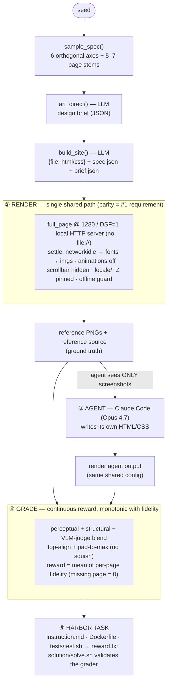
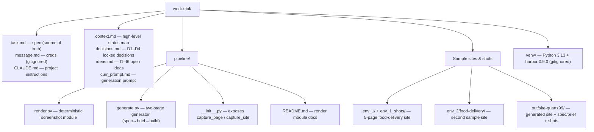

# Pipeline & Repo Diagrams

Mermaid source for the project diagrams. Edit any label below and it re-renders
(GitHub renders Mermaid natively; locally use the Mermaid VS Code extension or
https://mermaid.live).

## Pipeline architecture

The deliverable: a pipeline that turns screenshots of a generated multi-page
site into a Harbor task, then grades an agent's HTML/CSS replication on a
continuous reward.

## Repo layout

