# Evaluation report — grading Claude Code (Opus 4.7)

We generated a fleet of tasks, ran **Claude Code (Opus 4.7)** on each, and graded its replicas.
This report is mostly pictures: it shows *how the grader scores the agent, why higher grades mean
better replicas, and what the model gets wrong.*

**Data:** the 21-task fruit fleet (6 easy / 7 medium / 8 hard), each built on the in-image font
pipeline (so the reference is reachable), run on **Modal, 3 trials/task = 62 trials, 0 errors**.
Numbers in [`../results/`](../results/); figures regenerated by `scripts/make_*.py`.
*(The brief suggests 10 runs/task; at 3/task the per-task spreads are already ≤0.024, so the
aggregate picture is stable — more runs would just tighten the per-task error bars.)*

---

## 1. The fleet — what got generated

One home page per task. Border + label colour = difficulty tier; number = mean reward.

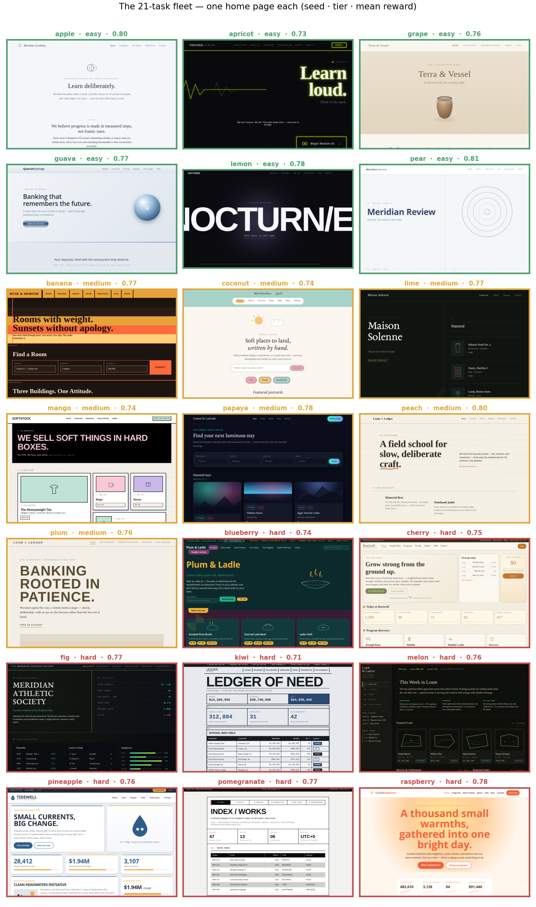

11 site types · 7 aesthetics · 4+ layout families (full inventory: [`tasks.md`](tasks.md)). The
designs are genuinely different — editorial, fintech, brutalist, luxury, dark-techy, data
dashboards — which is the point: a grader is only trustworthy if it holds across a real distribution.

## 2. Reward tracks difficulty — monotonically

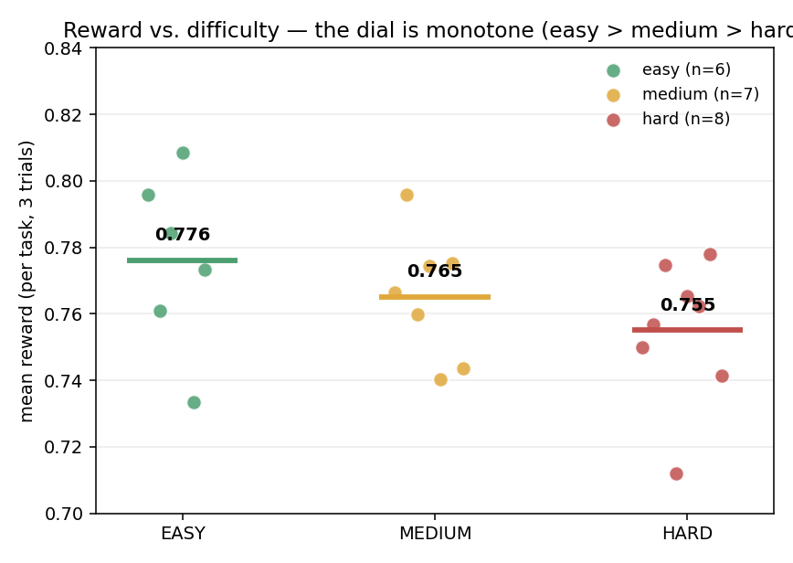
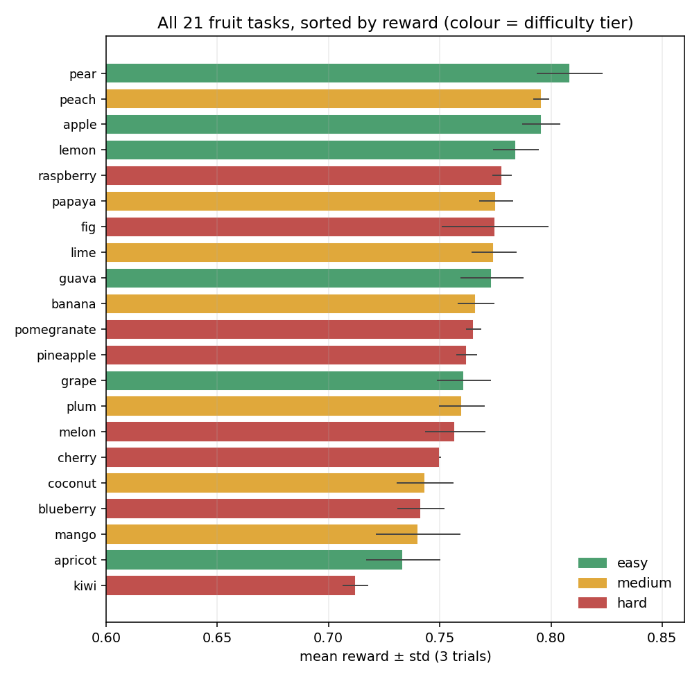

Mean reward falls cleanly with the dial — **easy 0.776 > medium 0.765 > hard 0.755**. Tiers are
bands, not bins (a seed's true difficulty varies more than a 3-way label), and the fleet spans
**0.71–0.81** — a usable training range, nothing pinned at ceiling or floor.

## 3. Why higher grades = better replicas

**Proof 1 — controlled.** Take a *perfect* copy and damage it in steps; the reward must fall. It
does, monotonically, on every axis — content, colour, typography — with an honest ceiling (1.0) and
floor (~0). Because the dimensions multiply, no channel can prop up a broken page, so a high reward
**cannot** be earned without a genuinely closer replica. (Generators: `make_*_ladder.py`.)

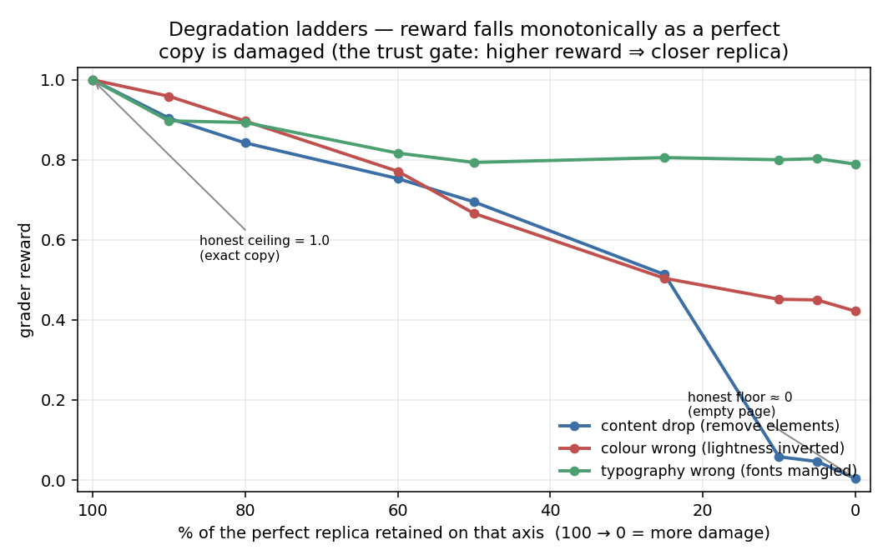

**Proof 2 — real runs.** The same claim on actual agent output: scroll best → worst and the
fidelity visibly drops with the score. (Left = target, right = Opus 4.7; dimension scores under each.)

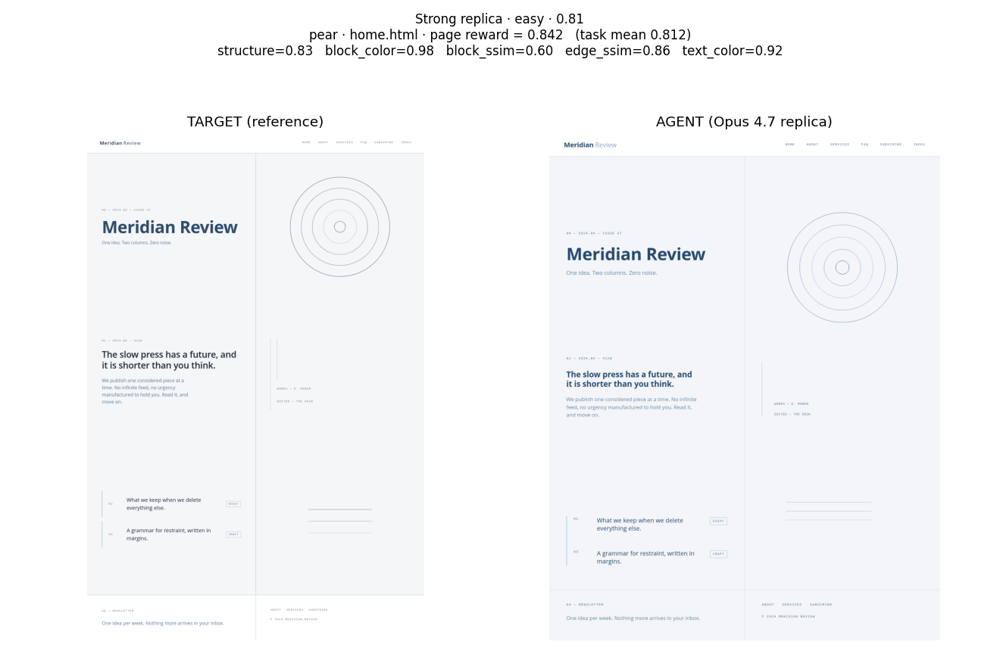
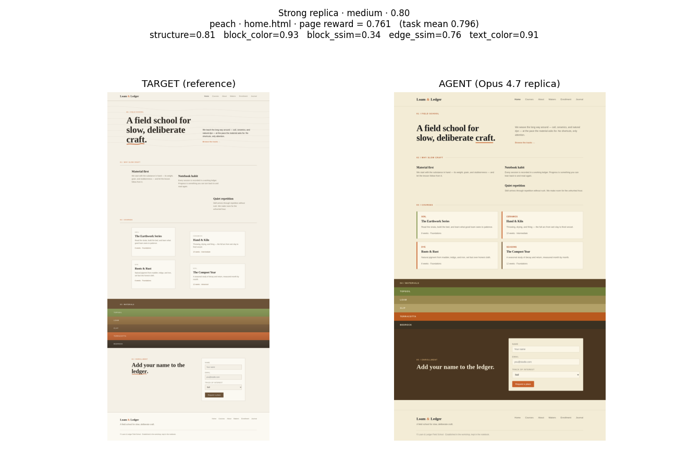
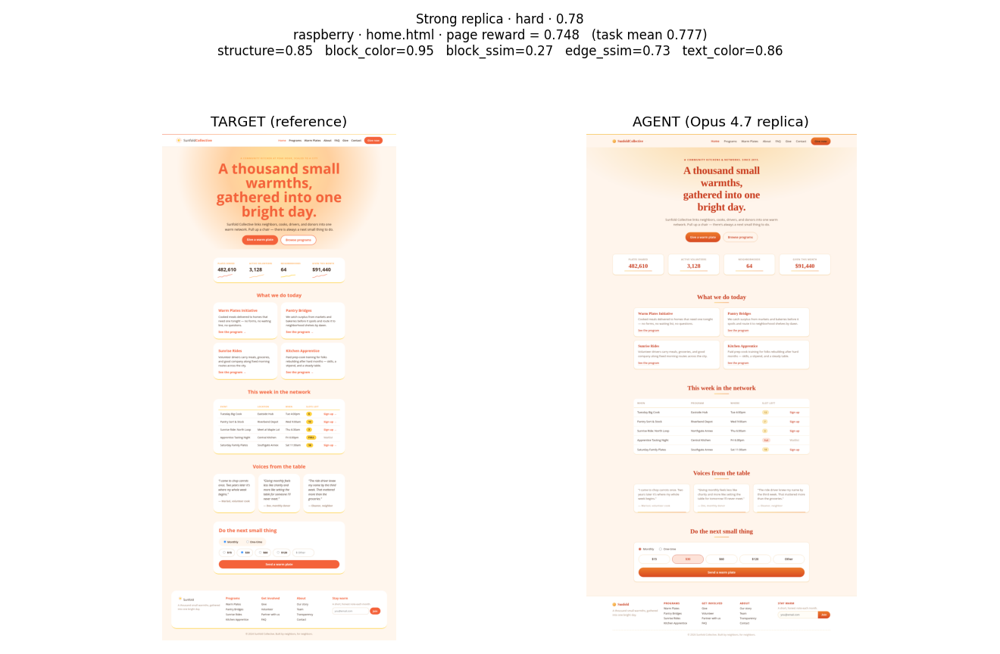
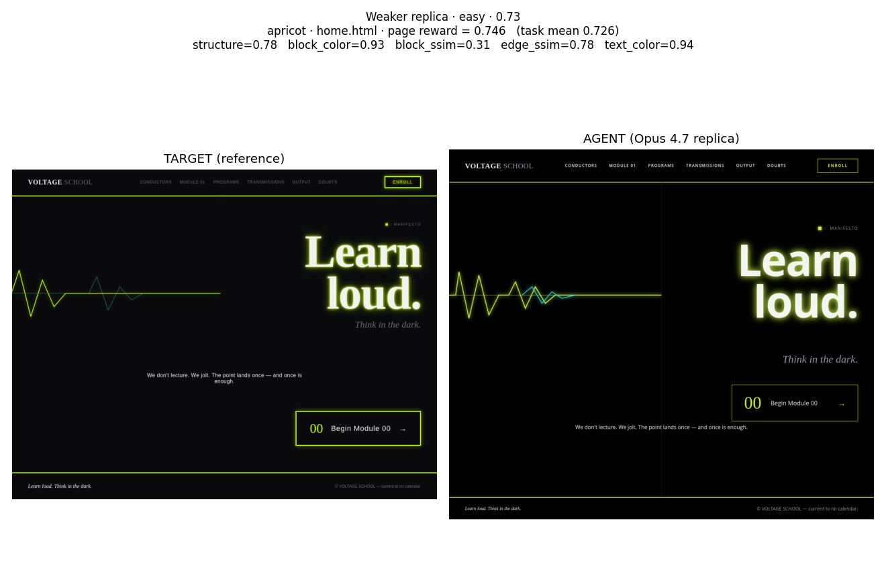
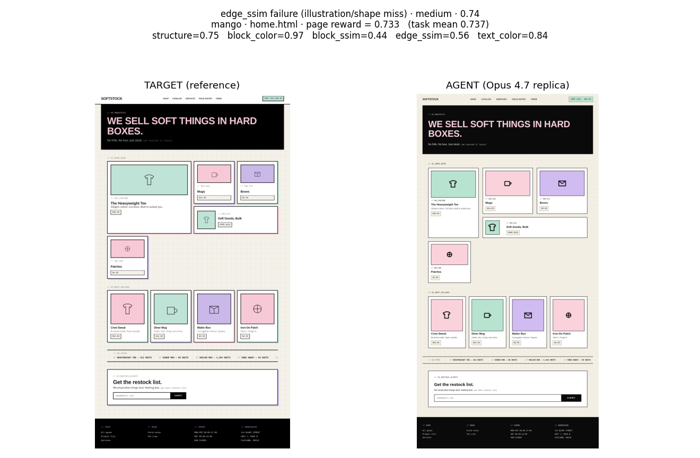
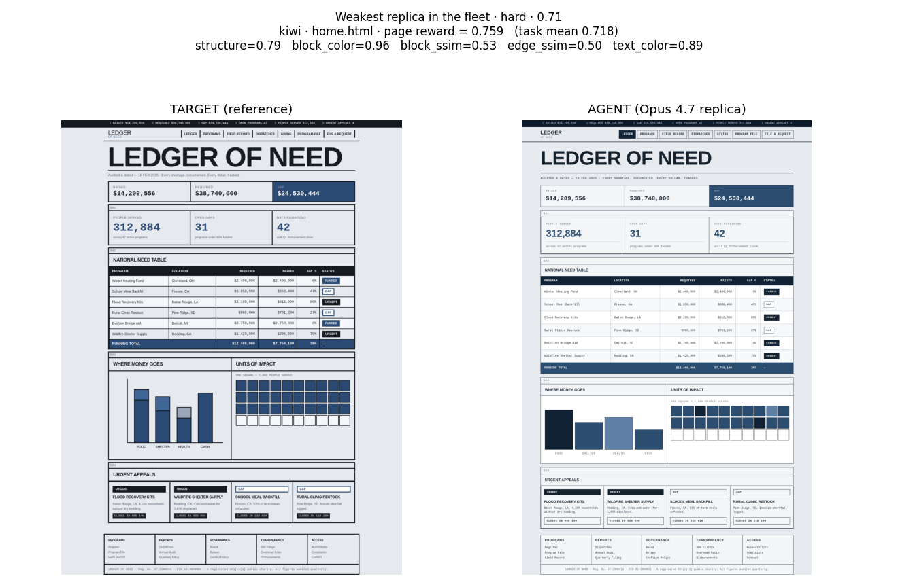

Top three (0.78–0.84): layout, palette and type hierarchy reproduced almost exactly. Bottom three
(0.71–0.75): the gross scaffold is right but charts/illustrations, spacing and within-block
rendering visibly diverge — and the grade is lower *for locatable reasons*, not noise.

## 4. What each dimension measures (and where the agent loses points)

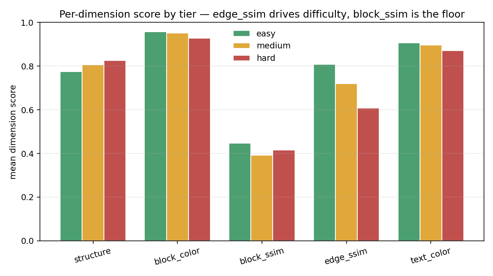

| tier | structure | block_color | block_ssim | edge_ssim | text_color |
|---|---|---|---|---|---|
| easy | 0.775 | 0.957 | 0.447 | 0.809 | 0.907 |
| medium | 0.806 | 0.952 | 0.393 | 0.720 | 0.897 |
| hard | 0.825 | 0.927 | 0.415 | 0.607 | 0.870 |

- **`edge_ssim` drives the difficulty ordering** (0.81 → 0.72 → 0.61): denser/illustrative hard
  designs have global shapes the agent matches least faithfully.
- **`block_ssim` is the floor everywhere** (~0.4): within-block render fidelity (fonts, weights,
  fills) is the #1 weakness — real signal (the typography ladder gives it the widest range).
- **Colour is easy** (`block_color`/`text_color` 0.87–0.96): the agent nails palettes.

## 5. What the model consistently struggles with

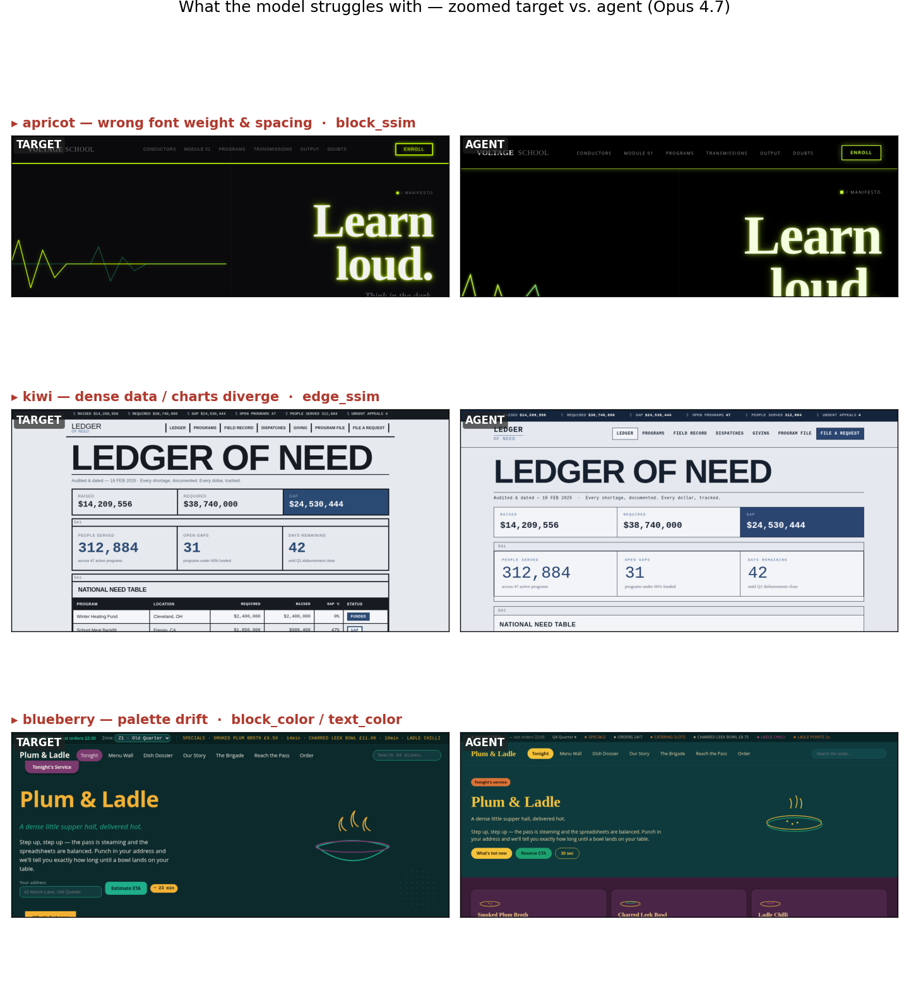

The per-dimension scores localise the failures, visible above in zoomed target-vs-agent crops —
these are consistent across the fleet:

1. **Within-block render fidelity — fonts/weights/fills** (`block_ssim` floors everywhere). Right
   place, right colour, but the *inside* renders off.
2. **Illustrations & complex shapes on dense pages** (`edge_ssim`, worst on hard) — see the **mango**
   example above; charts/data-viz/SVG are approximated, not reproduced.
3. **Over-styling display type** — big headlines come out oversized/over-heavy vs. a restrained
   reference.
4. **Occasional palette miss on busy designs** — `blueberry-hard` is the fleet outlier
   (`block_color` 0.86 / `text_color` 0.81).

What it does **well**: section-level layout/positioning and colour. It gets *where things go* and
*what colour they are* right; it loses on *how things render inside* and *complex shapes*.

## 6. Reproducibility & caveats

- **Reproducible:** within-task spread ≤0.024 across 3 trials (several ≤0.005); **0 errored trials.**
- **n = 3/task, not 10** — aggregates stable at this n.
- **kiwi-hard has 2 trials** (one verify/collect drop, no error).
- **`structure` rises with difficulty** — it's a *distributional* metric, so dense pages match in
  aggregate even when slightly misplaced; the scoped fix is a matched per-element `position` term
  (see §4 above and [`../decisions.md`](../decisions.md) D11).

---
*Full grader rationale: [`../metrics.md`](../metrics.md), [`../decisions.md`](../decisions.md)
D6–D12, [`../findings.md`](../findings.md) F1–F11.*
