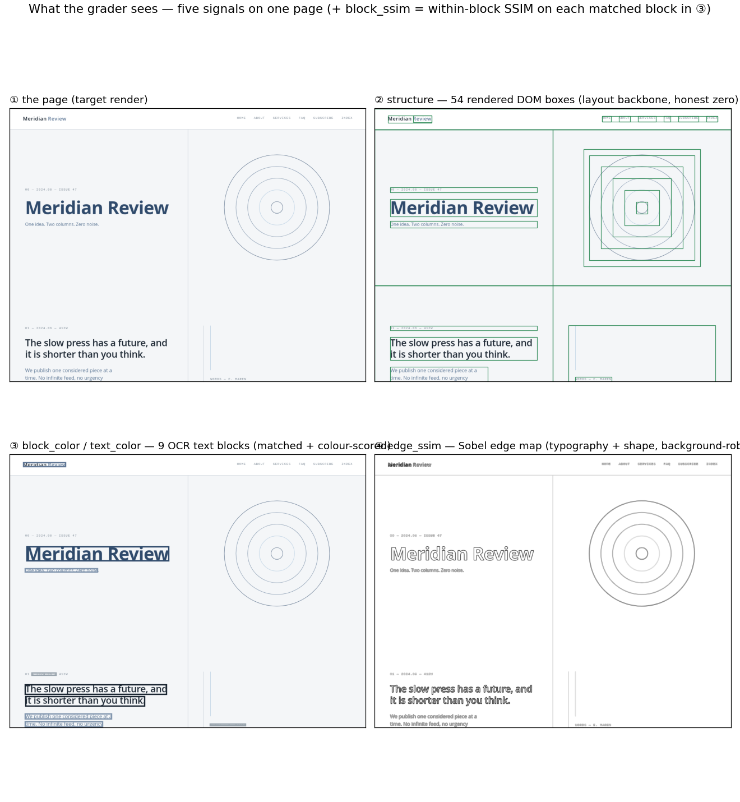

# Overview — how the pipeline works

A factory that turns a **seed** into a graded **RL task**: generate a real multi-page website,
render it, hand an agent only the screenshots, and score its HTML/CSS replica on a continuous
reward. This doc is the architecture map; the *why* behind each choice is in
[`../decisions.md`](../decisions.md) (D1–D12), the empirical results in
[`evaluation.md`](evaluation.md).

## Three subsystems

```
   ┌──────────────────┐    ┌──────────────────┐    ┌──────────────────┐
   │   Generator      │──▶ │    Harbor task   │──▶ │     Grader       │
   │ (LLM site maker) │    │  (agent runtime) │    │ (offline reward) │
   └──────────────────┘    └──────────────────┘    └──────────────────┘
        produces a            Claude Code (Opus 4.7)    renders the agent's
        Harbor task dir       sees screenshots →         site the SAME way →
        + reference renders   writes HTML/CSS            reward.txt ∈ [0,1]
```

One command runs the whole left half: `./build_task.sh <seed> <easy|medium|hard>`.

## 1 · Generator — a seed becomes a real website

A two-stage LLM "design studio" (one prompt collapses to the model's prior, so we sample a
*spec* first, then split design from build — see [`../ideas.md`](../ideas.md) I6). Lives in
[`../pipeline/generate.py`](../pipeline/generate.py).

```
┌─ SPEC SAMPLER ─────────────────────────────── sample_spec(seed, difficulty) ─┐
│  Seeded mix of 6 orthogonal axes → SiteSpec                                  │
│    site_type · aesthetic · palette · typography · layout · density           │
│    + 5–7 page slugs (home/about/…)   · difficulty sets the density text      │
│  →  spec.json   (also the distribution metadata for the fleet)               │
└──────────────────────────────────────────────────────────────────────────────┘
                                   │  randomness lives here
                                   ▼
┌─ ART DIRECTOR (LLM) ───────────────────────────────────── art_direct(spec) ──┐
│  Turns the axes into a concrete brief: brand, palette (hex), font stacks,    │
│  per-page sections — design intent only, no code.   →  brief.json            │
└──────────────────────────────────────────────────────────────────────────────┘
                                   │  craft lives here
                                   ▼
┌─ BUILDER (LLM) ────────────────────────────────────────── build_site(brief) ─┐
│  Writes static HTML + CSS to the brief (continuation-on-truncation).         │
│  →  solution/site/{home,about,…}.html + style.css                            │
└──────────────────────────────────────────────────────────────────────────────┘
```

The result is a genuinely varied fleet (11 site types, 7 aesthetics — full grid in
[`evaluation.md`](evaluation.md)):


## 2 · Render — the reference and the agent share ONE font world

The single most important plumbing decision. The reference is rendered **inside the same Docker
image the agent/verifier uses** ([`../pipeline/render.py`](../pipeline/render.py), called from
`build_task.sh`), so fonts/engine match and a perfect copy can actually score 1.0.

```
solution/site/*.html ──▶ [ ubuntu:24.04 + Chromium + open font palette ] ──▶ reference
                          (the task's OWN env image)                          screenshots
                                                                              + box sidecars
            the agent later renders ITS site in the SAME image ───────────────────┘
```

> We learned this the hard way: when the reference was rendered on the build host (macOS fonts)
> and the agent in bare Ubuntu, the *same HTML* scored **0.89 against itself** — a perfect replica
> was capped 11% below ceiling by fonts it could never reproduce. Rendering both sides in one image
> fixes it. ([`../findings.md`](../findings.md) F10/F11.)

## 3 · Harbor task surface — what the agent sees vs. what's hidden

`build_task.sh` assembles a self-contained task dir; in the container it splits into an
agent-readable surface and a hidden grading surface (D5).

```
┌─ HARBOR TASK CONTAINER ──────────── ubuntu:24.04 · playwright + chromium · tesseract ─┐
│                                                                                       │
│  AGENT SURFACE                                                                        │
│    /app/target/<page>.png     the ONLY input — reference screenshots (read-only)      │
│    /app/site/<page>.html      where the agent writes its replica (+ style.css)        │
│    instruction.md             "replicate each page's visual design in static HTML/CSS"│
│                                                                                       │
│  HIDDEN / VERIFY-TIME                                                                  │
│    /tests/reference/*.png + *.boxes.json   ground truth (not visible to the agent)    │
│    /opt/pipeline/                          the grader code (PYTHONPATH)                │
│    /logs/verifier/reward.txt               the single-float reward the verifier writes│
└───────────────────────────────────────────────────────────────────────────────────────┘
```

Task dir on disk (one per seed, self-contained & runnable):

```
website-rl-eval-harbor/eval-<seed>-<tier>/
  task.toml  instruction.md  run.agent.yaml  run.oracle.yaml
  environment/  Dockerfile · target/*.png (agent input) · pipeline/ (grader code)
  tests/        test.sh (verifier) · reference/*.png + *.boxes.json (ground truth)
  solution/     site/ (the oracle ~1.0) · solve.sh
```

## 4 · Grader — five offline dimensions → one continuous reward

Runs in the verifier, fully offline (numpy/scipy/pillow + the `tesseract` binary — no API, no
torch). It renders the agent's site through the *same* path, then scores five dimensions and
combines them as a **weighted geometric mean** — so a near-zero in any one tanks the reward (the
anti-gaming backbone). [`../pipeline/grader.py`](../pipeline/grader.py),
[`../metrics.md`](../metrics.md).

```
agent /app/site ─▶ render ─▶ ┌─ per page ─────────────────────────────────┐
reference        ─▶ (cached)  │  structure    rendered DOM-box layout      │
                              │  block_color  per-region colour (CIEDE2000)│   weighted
                              │  block_ssim   within-block render fidelity  │── geometric ─▶ reward
                              │  edge_ssim    global edge / shape (Sobel)   │   mean         ∈ [0,1]
                              │  text_color   matched-text glyph colour     │
                              └────────────────────────────────────────────┘
                                 mean over reference pages · missing page = 0
```

What those five signals actually look like on one page — a deliberate multi-signal read, not a
single similarity score:



**Why it's trustworthy:** we damaged a *perfect* copy in controlled steps and re-graded — the
reward falls monotonically to an honest floor on every axis (the trust gate before scaling):


…and on real agent runs, a higher grade is a visibly closer replica (left = target, right = Opus 4.7):


Full results, per-dimension analysis, and the model's failure patterns:
**[`evaluation.md`](evaluation.md)**.
